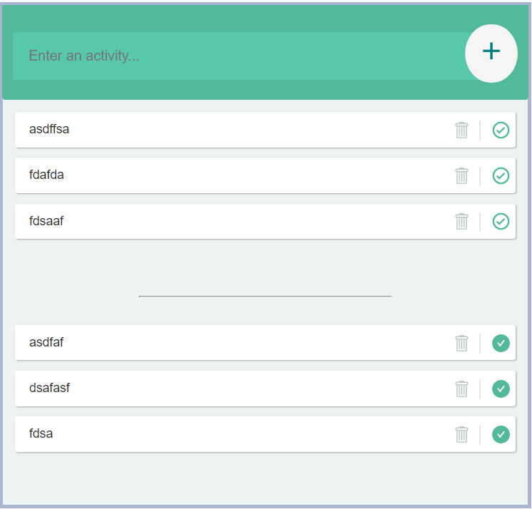
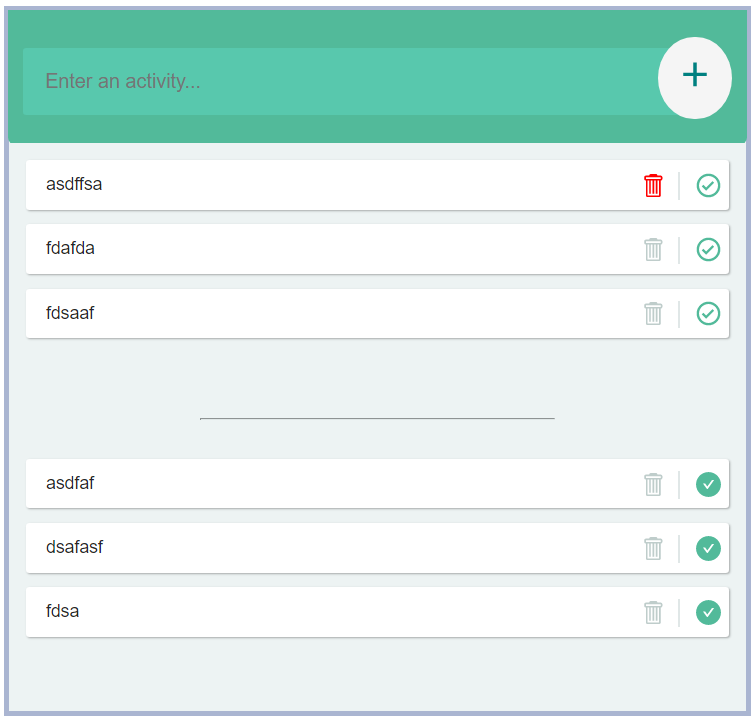

# Todo DOM-React
This is basic todo app
 This is basic Todo-App which have basic functionalities.
 we add our task by click add button.

we remove our task on press delete button

We move our task from pending list to done list

Font I use is React_Fonts.

<h2>Netlify link: "https://epic-kare-c8f983.netlify.app/"</h2>
